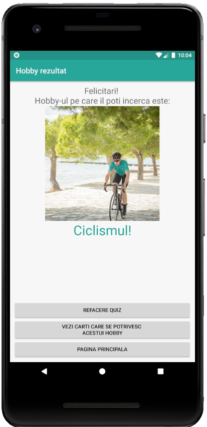

# AndroidApp_ToDo_Journal_Timer_Quiz
Android Application that contains multiple functionalities such as ToDo List,  Journal (with titles, entry description, time stamps), Countdown timer, and a Quiz that generates different responses based on question answers (like a Personality test).


## Screenshots
<p float="left">
  
  
  
  
</p>
<p float="left">
  
  
  
  
</p>
<p float="left">
  
  
  
  
</p>
<p float="left">
  
  
  
</p>

## About
I worked on this project (with zero knowledge prior to Java and Android) from March 2019 until May 2019 in order to see how it's like to build an Application on Android.

## Clone, Build and run the app
```
$ git clone https://github.com/radualexandrub/AndroidApp_ToDo_Journal_Timer_Quiz.git RaduApp
$ cd RaduApp
```
- Import the project into Android Studio by selecting build.gradle or settings.gradle from the root of the project.
- Run the app using the "play" or "debug" button.

## Dependencies and versions used:
```
Android Studio 3.5
Build #AI-191.8026.42.35.5791312, built on August 9, 2019
JRE: 1.8.0_202-release-1483-b03 amd64
JVM: OpenJDK 64-Bit Server VM by JetBrains s.r.o
```

Android version >6.0 (Marshmallow)
```
Android SDK Tools v26.1.1
Android SDK Platform-Tools v29.0.4
Android emulator v29.2.1
```

from build.gradle dependencies:
```
'com.android.tools.build:gradle:3.1.4'
'com.google.gms:google-services:3.1.1'
```

```
> Task :app:androidDependencies
debug
debugCompileClasspath - Dependencies for compilation
+--- com.android.support:design:28.0.0@aar
+--- com.android.support:appcompat-v7:28.0.0@aar
+--- com.google.firebase:firebase-core:11.8.0@aar
+--- com.android.support.constraint:constraint-layout:1.1.3@aar
+--- com.google.firebase:firebase-database:11.8.0@aar
+--- com.android.support:cardview-v7:28.0.0@aar
+--- com.android.support:recyclerview-v7:28.0.0@aar
+--- com.google.firebase:firebase-analytics:11.8.0@aar
+--- com.google.firebase:firebase-database-connection:11.8.0@aar
+--- com.google.firebase:firebase-analytics-impl:11.8.0@aar
+--- com.google.firebase:firebase-iid:11.8.0@aar
+--- com.google.firebase:firebase-common:11.8.0@aar
+--- com.google.android.gms:play-services-tasks:11.8.0@aar
+--- com.google.android.gms:play-services-basement:11.8.0@aar
+--- com.android.support:support-v4:25.2.0@aar
+--- com.android.support:support-fragment:28.0.0@aar
+--- com.android.support:animated-vector-drawable:28.0.0@aar
+--- com.android.support:support-core-ui:28.0.0@aar
+--- com.android.support:support-core-utils:28.0.0@aar
+--- com.android.support:support-vector-drawable:28.0.0@aar
+--- com.android.support:transition:28.0.0@aar
+--- com.android.support:loader:28.0.0@aar
+--- com.android.support:viewpager:28.0.0@aar
+--- com.android.support:coordinatorlayout:28.0.0@aar
+--- com.android.support:drawerlayout:28.0.0@aar
+--- com.android.support:slidingpanelayout:28.0.0@aar
+--- com.android.support:customview:28.0.0@aar
+--- com.android.support:swiperefreshlayout:28.0.0@aar
+--- com.android.support:asynclayoutinflater:28.0.0@aar
+--- com.android.support:support-media-compat:25.2.0@aar
+--- com.android.support:support-compat:28.0.0@aar
+--- com.android.support:versionedparcelable:28.0.0@aar
+--- com.android.support:collections:28.0.0@jar
+--- com.android.support:cursoradapter:28.0.0@aar
+--- android.arch.lifecycle:runtime:1.1.1@aar
+--- com.android.support:documentfile:28.0.0@aar
+--- com.android.support:localbroadcastmanager:28.0.0@aar
+--- com.android.support:print:28.0.0@aar
+--- android.arch.lifecycle:viewmodel:1.1.1@aar
+--- com.android.support:interpolator:28.0.0@aar
+--- android.arch.lifecycle:livedata:1.1.1@aar
+--- android.arch.lifecycle:livedata-core:1.1.1@aar
+--- android.arch.lifecycle:common:1.1.1@jar
+--- android.arch.core:runtime:1.1.1@aar
+--- android.arch.core:common:1.1.1@jar
+--- com.android.support:support-annotations:28.0.0@jar
+--- com.android.support.constraint:constraint-layout-solver:1.1.3@jar
+--- com.google.firebase:firebase-database-license:11.8.0@aar
+--- com.google.firebase:firebase-analytics-license:11.8.0@aar
+--- com.google.firebase:firebase-database-connection-license:11.8.0@aar
+--- com.google.android.gms:play-services-basement-license:11.8.0@aar
+--- com.google.firebase:firebase-common-license:11.8.0@aar
+--- com.google.android.gms:play-services-tasks-license:11.8.0@aar
+--- com.google.firebase:firebase-analytics-impl-license:11.8.0@aar
\--- com.google.firebase:firebase-iid-license:11.8.0@aar
```
